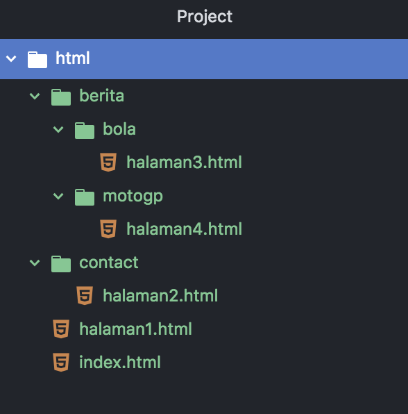
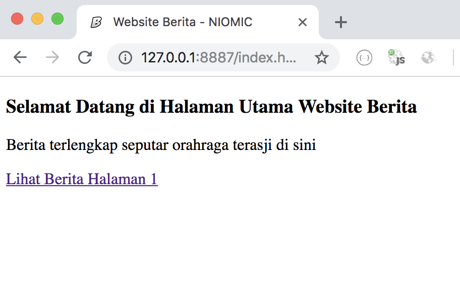
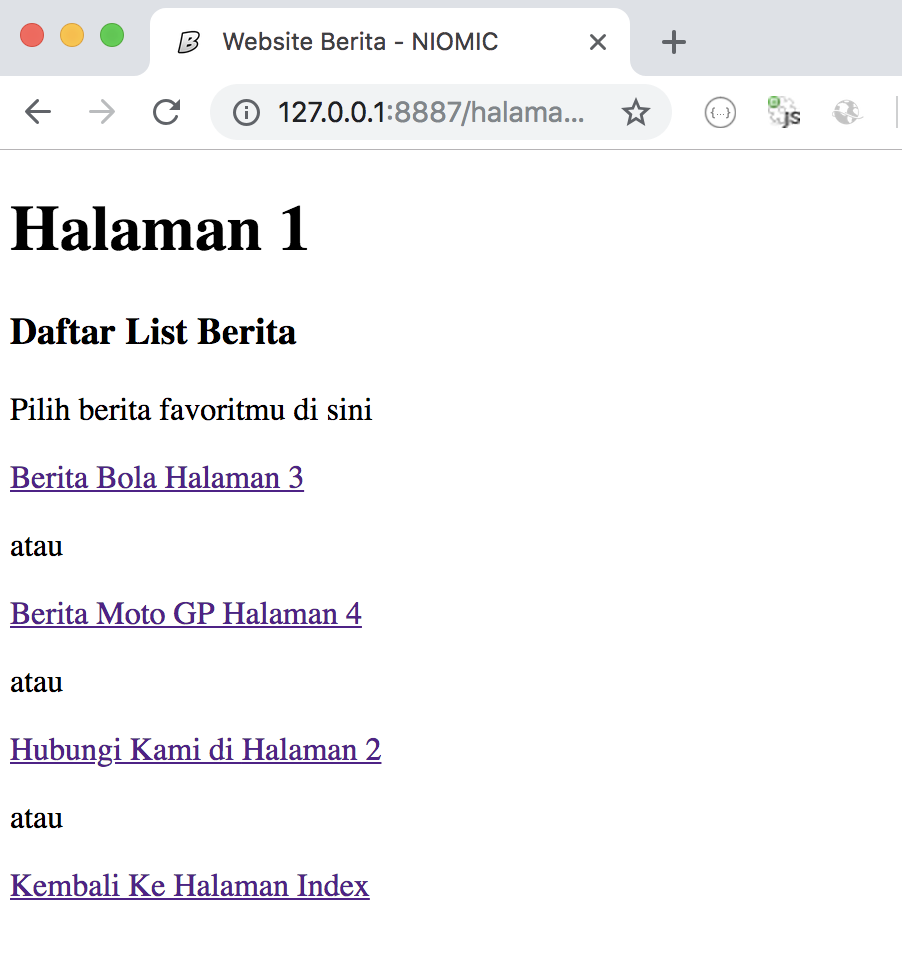
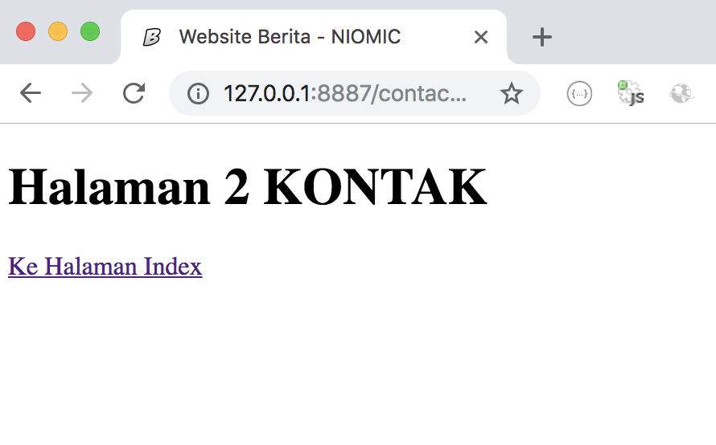
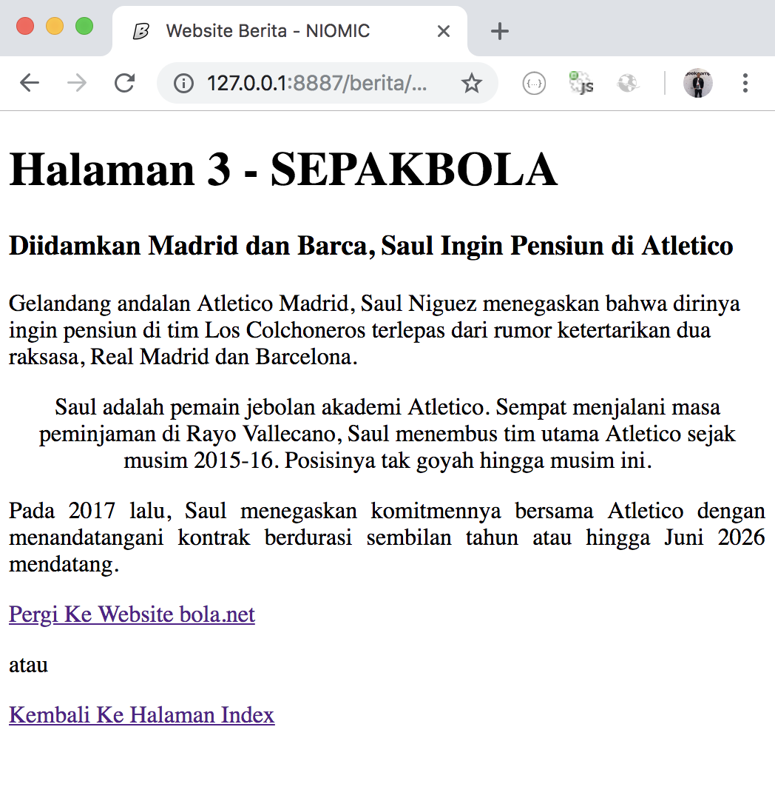

# TUGAS 4 HTML
1. Gunakan image untuk favicon berikut : https://cdns.klimg.com/bola.net/library/i/v2/apple-touch-icon.png  
2. Buatlah 4 Folder dan 5 File HTML dengan susunan sebagai berikut :  
- Buatlah file index.html, halaman1.html, folder berita dan folder contact  
- Didalam folder contact buatlah file halaman2.html  
- Didalam folder berita buatlah folder bola dan folder motogp  
- Didalam folder bola buatlah file halaman3.html  
- Didlaam folder motogp buatlah file halaman4.html  
  
3. Tuliskan code HTML di masing-masing halaman dan ketika dijalankan akan menampilkan seperti berikut :  
*** - index.html :  
 
*** - halaman1.html :  
  
*** - halaman2.html :  
  
*** - halaman3.html :  
  
Di halaman 3 tambahkan link yang mengarah ke Website bola.net dan ketika di Klik membuka tab baru (target=”_blank”)  
*** - halaman4.html :  
  
Di halaman 4 tambahkan link yang mengarah ke Website motogp.com dan ketika di Klik membuka tab baru (target=”_blank”)  

